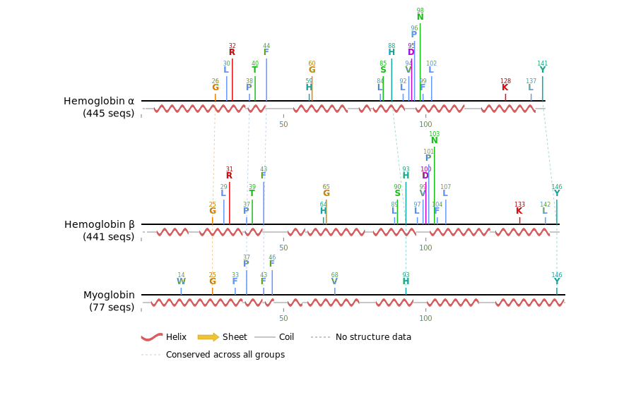

# Protein Alignment Conservation Analyzer

A web platform for visualizing conserved residues in protein sequence alignments.



## Features

- Upload ZIP files containing multiple FASTA alignment files
- Configure conservation thresholds (global or per-file)
- Generate SVG visualization with:
  - Color-coded conserved residues
  - Smart label positioning to avoid overlap
  - Sequence position markers
  - File names for each alignment
- Download publication-ready SVG figures

## Installation

1. **Install Python dependencies:**
   ```bash
   pip install -r requirements.txt
   ```

2. **Install DSSP** (required for secondary structure analysis):

   DSSP is an external binary — BioPython calls it as a subprocess.

   ```bash
   # macOS (Homebrew)
   brew install dssp

   # Conda (any platform)
   conda install -c salilab dssp

   # Ubuntu/Debian
   sudo apt install dssp
   ```

   Verify it works:
   ```bash
   mkdssp --version
   ```

## Running the Application

1. **Start the Flask server:**
   ```bash
   python app.py
   ```

2. **Open your browser:**
   Navigate to `http://localhost:5000`

## Usage

1. **Prepare your data:**
   - Create a ZIP file containing your FASTA alignment files
   - Files should have extensions: `.fasta`, `.fa`, `.faa`, or `.fas`
   - Each FASTA file should contain a protein sequence alignment (all sequences same length)
   - The first sequence in each file will be used as the representative

2. **Upload and configure:**
   - Upload your ZIP file
   - Choose to use the default 95% conservation threshold for all files, or customize per file
   - Click "Generate SVG"

3. **Download:**
   - The SVG will be automatically downloaded
   - Open with any SVG viewer or import into Illustrator/Inkscape for further editing

## Color Scheme

Residues are colored using the ClustalX color scheme:
- **Blue** : A, V, I, L, M, F, W, P (hydrophobic)
- **Red** : K, R (basic/positive)
- **Magenta** : D, E (acidic/negative)
- **Green** : N, Q, S, T (polar)
- **Pink** : C (cysteine)
- **Orange** : G (glycine)
- **Cyan** : H, Y (aromatic/histidine)

## Technical Details

- **Maximum sequence length:** 400 residues
- **Conservation calculation:** Based on the most common residue at each position in the alignment
- **Label positioning:** Automatic vertical stacking when residues are clustered
- **File size limit:** 50 MB ZIP upload

## Project Structure

```
alvis/
├── app.py                 # Flask application
├── conservation.py        # Conservation analysis logic
├── structure.py           # Secondary structure extraction (PDB + DSSP)
├── svg_generator.py       # SVG generation with smart positioning
├── requirements.txt       # Python dependencies
├── templates/
│   └── index.html        # Web interface
└── static/
    └── style.css         # Styling
```

## Example FASTA Alignment Format

```
>Sequence1
MVHLTPEEKSAVTALWGKVN--VDEVGGEALG
>Sequence2
MVHLTPEEKTAVTALWGKVN--VDEVGGEALG
>Sequence3
MVHLTPEEKSAVNALWGKVNVGDEVGGEALG
```

## License

MIT
