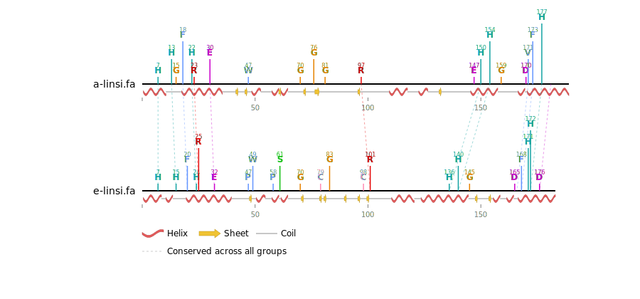

# Protein Alignment Conservation Analyzer

A web platform for visualizing conserved residues in protein sequence alignments.



## Features

- Upload ZIP files containing multiple FASTA alignment files
- Configure conservation thresholds (global or per-file)
- Generate SVG visualization with:
  - Color-coded conserved residues
  - Smart label positioning to avoid overlap
  - Sequence position markers
  - File names for each alignment
- Download SVG figures

## Documentation

- **[Getting started](docs/getting-started.md)** — install, run locally (Docker or Python), and a usage walkthrough
- **[Deployment](docs/deployment.md)** — production deployment guide (nginx + Docker on a VM)

## Color Scheme

Residues are colored by chemical properties:
- **Magenta** (255, 0, 255): G, Y, S, T, N, C, Q (polar/small)
- **Green** (70, 156, 118): V, I, L, P, F, M, W, A (hydrophobic)
- **Orange** (255, 140, 0): H (histidine)
- **Dark Red** (192, 0, 0): D, E (acidic)
- **Blue** (0, 0, 255): K, R (basic)

## Technical Details

- **Maximum sequence length:** 400 residues
- **Conservation calculation:** Based on the most common residue at each position in the alignment
- **Label positioning:** Automatic vertical stacking when residues are clustered
- **File size limit:** 50 MB ZIP upload

## Project Structure

```
alvis/
├── app.py                 # Flask application
├── conservation.py        # Conservation analysis logic
├── structure.py           # Secondary structure extraction (PDB + DSSP)
├── svg_generator.py       # SVG generation with smart positioning
├── requirements.txt       # Python dependencies
├── models/                # Dataclasses + business logic
├── routes/                # Flask blueprints
├── templates/             # HTML templates
├── static/                # CSS, JS
├── docs/                  # Getting-started + deployment docs
└── deployment/            # Production compose file + nginx config
```

## Example FASTA Alignment Format

```
>Sequence1
MVHLTPEEKSAVTALWGKVN--VDEVGGEALG
>Sequence2
MVHLTPEEKTAVTALWGKVN--VDEVGGEALG
>Sequence3
MVHLTPEEKSAVNALWGKVNVGDEVGGEALG
```

## License

MIT
